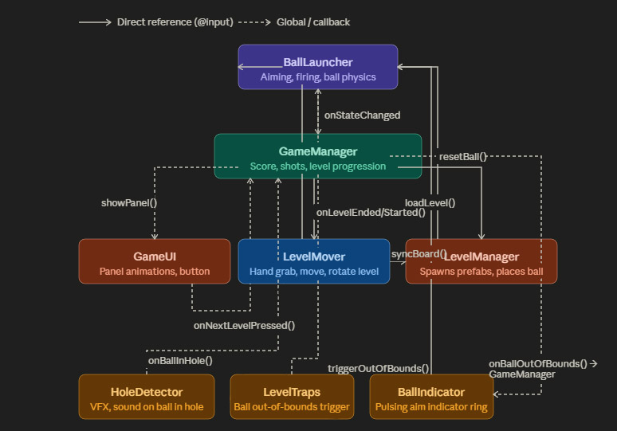

# Description

This is a project template for building your own golf-like games for Spectacles. Grab a ball with a pinch to start aiming, release to shoot the ball in the direction of the aim. The project includes a fully working game with 2 sample levels. The game is fully customizable: in the inspector you can specify a vast number of parameters – from maximum number of shots per level up to acceleration, enabling/disabling trail and its color, animation speeds, etc.

Additionally, the template has a **simulator mode** which allows to test the project in Lens Preview from start to finish: all the actions are performed with the mouse in the preview window. Turn it on in the `BallLauncher` script (attached to the Ball object) and `LevelMover` script (attached to the Level_Mover object). **DON'T FORGET TO TURN SIMULATOR MODE OFF BEFORE TESTING ON SPECTACLES**, otherwise it won't work with hand interactions.

The template contains several scripts which are thoroughly commented for better understanding of methods and working logic. Additionally, each script's input is provided with `@hint`s which are shown in the inspector when hovering the mouse over a parameter. So you don't even need to know how to code to understand what does what.

---

## Script Workflow from Lens Launch to Game Over

1. **Startup:** `GameManager.onStart()` fires, calling `startLevel(0)`. This triggers `LevelManager` to instantiate the first level prefab, place the ball at the level's start point, and position the HUD board. `LevelMover` resets its state and `BallLauncher` is unblocked for input.

2. **Idle / Ready to shoot:** The ball sits still → `BallLauncher` broadcasts state `"IDLE"` → `BallIndicator` shows the blinking cylinder above the ball and (on first idle) reveals the hand hint.

3. **Player adjusts the level:** The player toggles `LevelMover` on. The ball's physics body goes static, input is blocked, and the grab cube appears. The player moves/rotates the level with pinch gestures (or mouse in simulator mode). On toggle-off, physics resumes, input is unblocked, and `LevelManager.syncBoardPosition()` realigns the `level_info` board.

4. **Aiming & shooting:** The player aims → state becomes `"AIMING"` → `BallIndicator` hides and destroys the hand hint. On release, the ball is fired (`"FIRED"` → `"MOVING"`), `GameManager.onShotStarted()` marks a pending shot.

5. **Ball stops:** `BallLauncher` reports `"IDLE"` again → `GameManager.onBallStopped()` increments the shot counter and updates the `level_info` board. If shots exceed `maxShotsPerLevel`, `triggerGameOver()` is called immediately.

6. **Ball hits a trap:** `LevelTraps` detects the overlap and calls `BallLauncher.triggerOutOfBounds()` → `GameManager.onBallOutOfBounds()` increments the shot counter. If the limit is exceeded, game over triggers; otherwise the ball resets and the cycle repeats from Idle.

7. **Ball enters the hole:** `HoleDetector` detects the overlap, plays the sound and VFX animation, then calls `GameManager.onBallInHole()`. The level score is calculated, `LevelMover` is locked, and `GameUI` animates the score panel in — showing contextual text (*Hole in One*, *Great Shot*, etc.).

8. **Between levels:** The player taps Next Level → `GameUI` animates out → `GameManager.onNextLevelPressed()` calls `startLevel(next)`, restarting the cycle from Startup.

9. **Game Over:** Triggered either by running out of shots on the last level or by completing it. `GameUI` shows the final score panel with a Play Again button → `GameManager.onRestartPressed()` resets the total score and calls `startLevel(0)`.

---

## Script Dependencies and Description

---

### BallLauncher

Main ball script. Attached to the ball object with `BodyComponent`. Script is in charge of ball behavior and states.

**States:** `IDLE` → `AIMING` → `FIRED` → `MOVING` → `IDLE`

**Public methods:** `setInputBlocked(bool)`, `resetBall(pos)`, `resetLastShotPosition()`, `triggerOutOfBounds()`, callback `onStateChanged`.

- **Aiming:** Right hand pinch within `grabRadius` of the ball → `AIMING`. Each update computes the XZ vector from pinch to ball; launch direction is the inverse.
- **Firing:** `onPinchUp` / `onHandLost` → `fire()`. Force = `t * launchForceMultiplier`, where `t = clamp(flatDist / maxPullDistance, 0..1)`. If `t < 0.01` — cancelled.
- **Slingshot:** `slingBase` (parent of arrow + powerBar + slingPart) snaps to ball position. `slingPart` scales along Z (`REST=0.125` → `MAX=1.65`). On release: snap animation 0.05s, impulse applied when Z ≤ 0.12, hidden after 0.35s. Sounds: stretch, weak/strong release (threshold `t=0.85`), wall hit.
- **Power bar:** Color Grey → Yellow → Green → Red by `t` (0 / 0.25 / 0.5 / 0.75 / 1.0), where `t` is pinch amount of maximum pinch.
- **Out of bounds:** Called from `outOfBoundsTriggers[]` or `LevelTraps`. Ball stops, `dynamic=false`, VFX + sound is played and returns to `lastShotPosition` after VFX animation ends.
- **Ball stop:** `tryStopBall` — compares velocity² against threshold², 5-frame guard after impulse. `FIRED` → `IDLE` + `GameManager.onBallStopped()`.
- **Trail:** Ribbon mesh via `MeshBuilder` (circular buffer, pre-allocated), updated every `trailUpdateInterval` frames, alpha 0→1 (oldest→newest vertices).

---

### LevelManager

Stores array of `levelPrefabs: ObjectPrefab[]`; levels are added to the array via inspector. Array should have at least one level for the lens to work properly; the max quantity is not limited. Build your level in the scene as a child of `Level_Container`, save it as a prefab, delete from the scene and add the newly created prefab to the array.

**Prefab structure:** `child(0)` = `StartPoint` (ball spawn), `child(1)` = `BoardPoint` (UI info board position).

> **Important:** Make sure the topmost child of the prefab is positioned where the ball will spawn (use nullObject/sceneObject) and the second topmost is where the information board is positioned.

- `loadLevel(index)` — destroys current level (if a previous level is spawned), instantiates a new one.
- `syncBoardPosition()` — called by `LevelMover` on deactivation to update the board position after the prefab is moved.

---

### LevelMover

Activated by toggle when `ballIsIdle && !levelEnded` to prevent ball movement by physics while the player moves/rotates the level. On activation: `ballBody.dynamic=false`, blocks launcher, shows `grabCube` and `instructionLabel`.

**Grab modes (hand tracking):**
- `MOVE` — right hand pinching, moves `levelRoot` in space.
- `ROTATE` — both hands pinching, rotates around Y using the XZ angle between hands.
- `NONE` — default.

**Grab modes (simulator mode):** First screen tap + mouse movement moves the level; next tap rotates it, and so on.

**Level Prefab contains:**
- `HoleDetector` — `onOverlapEnter` on collider/physics body → sound + VFX (animated texture), after VFX ends → `GameManager.onBallInHole()`.
- `FlagController` — lerp animation of flag along Y (`loweredY` ↔ `raisedY`) when a ball (with physics body) enters/exits the trigger.
- `LevelTraps` — `onOverlapEnter`, finds `triggerOutOfBounds()` method on the ball object and calls it.

---

### GameUI

UI frame shown between levels.

**Panels:** `BETWEEN_LEVELS` | `GAME_OVER` | `OUT_OF_SHOTS`

**Messages:** HOLE IN ONE! (1 shot), GREAT SHOT! (≤3 shots), LEVEL COMPLETE, OUT OF SHOTS, GAME OVER.

**Animation:** Scale overshoot → 1.0 on show, 0 on hide.

**Button:** `CapsuleButton` from SpectaclesUIKit. After dismiss → `GameManager.onNextLevelPressed()`.

---

### BallIndicator

Subscribes to `BallLauncher.onStateChanged`. When `IDLE` — positions itself above the ball (`yOffset`) and pulses material alpha (`alphaMin` ↔ `alphaMax`). In `AIMING` — hides and destroys `handHint` (one time only). Shall be attached to the indicator object (basic cylinder in the example).
